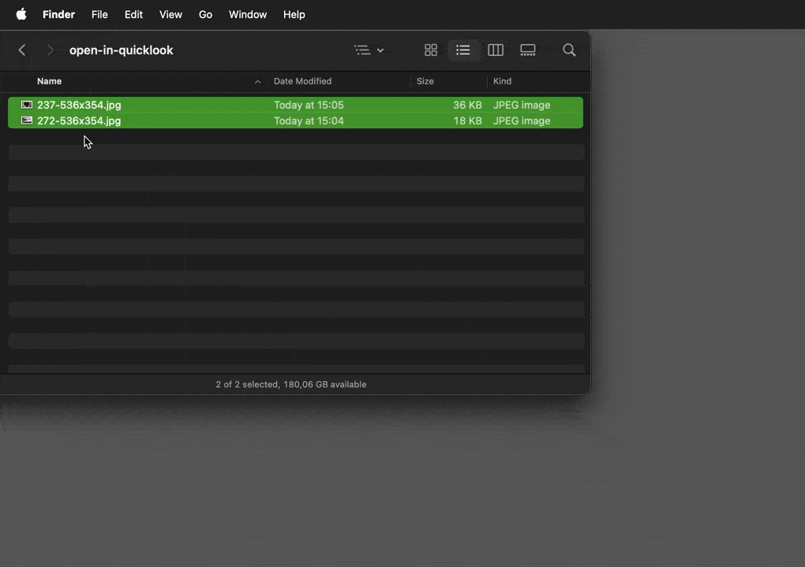

[](#)
[](https://github.com/relikd/OpenQL/releases/latest)
[](https://github.com/relikd/OpenQL/releases)


Open With QuickLook
===================

Open files with Quick Look. (by double click)

For those apps where you think the QuickLook preview is better than the app.




Installation
------------

Requires macOS High Sierra (10.13) or higher.
(you can probably compile on 10.6).

```sh
brew install --cask relikd/tap/OpenQL
xattr -d com.apple.quarantine "/Applications/Open in QuickLook.app"
```

or download from [releases](https://github.com/relikd/OpenQL/releases/latest).

Features
--------

The app is just a wrapper around `qlmanage -p`.
Nothing more.

- 60 lines of code
- Small app size (150 Kb)
- Written in Objective-C to allow __very old__ macOS versions.


Usage
-----

You can set this app to open any kind of file.

- Select the file / file-type you want to open with QuickLook
- Right click > Get Info (⌘I)
- Change application in "Open with:" menu
- Press button "Change All…"

Now you can double-click that file-type and it will open the QuickLook preview.
